# Ensemble Learning in Transformer-based Models for Persian Sentiment Analysis

This repository hosts the companion code for the paper **“Ensemble Learning in Transformer-based Models for Persian Language Sentiment Analysis.”** It benchmarks classic ML pipelines, strong transformer baselines, and ensemble strategies on Persian tweet datasets, with a transformer-based weighted soft-voting ensemble (mBERT, ParsBERT, XLM-RoBERTa, RoBERTa-fa) that reaches **75.18% accuracy**.

- Main study: 5,472 Persian tweets labeled with five emotions (ANGRY, FEAR, HAPPY, OTHER, SAD); primary results reported on this set.
- Two experimental tracks: (1) Short Persian Emotion Tweets (main) and (2) DeepSentiPers (translated split) as an extended analysis.
- Full preprocessing recipes for Persian text (normalization, stop-word removal, lemmatization with Hazm, TF-IDF features for classical models).
- Reproducible notebooks for both classical and transformer-based systems, including grid-search configs and evaluation artifacts (confusion matrices, classification reports).
- Preview of the paper available on request.

## Repository layout

- `proposed method on DeepSentiPers dataset.ipynb` — transformer baselines on the DeepSentiPers translated split.
- `stand-alone classic models + ensemble.ipynb` — TF-IDF + classic learners (MNB, LR, SVM, KNN, RF, XGBoost) and ensemble variants (bagging, boosting, voting, stacking) on the Short Persian Emotion Tweets dataset.
- `stand-alone deep models + ensemble.ipynb` — transformer baselines and ensemble hooks on the Short Persian Emotion Tweets dataset.

## Results snapshot

Key single-model scores from the notebooks (test sets).

### DeepSentiPers (translated, extended analysis)

- XLM-R (base): **73.5 F1**, 73.4 accuracy.
- ParsBERT: **73.6 F1**, 73.1 accuracy.
- RoBERTa-fa: 71.1 F1, 70.5 accuracy.
- mBERT: 69.3 F1, 68.3 accuracy.

### Short Persian Emotion Tweets (main; 5,472 tweets, 5 classes)

- Transformer deep ensemble (weighted soft voting over mBERT, ParsBERT, XLM-R, RoBERTa-fa): **75.18 accuracy** (best across all metrics in the study).
- XLM-R (base): **74.2 F1**, 74.3 accuracy.
- ParsBERT: **73.9 F1**, 73.5 accuracy.
- RoBERTa-fa: 70.5 F1, 70.4 accuracy.
- mBERT: 66.5 F1, 66.6 accuracy.
- Best classic ML (Logistic Regression, tuned): **56.5 F1**, 57.8 accuracy; SVM and stacking close behind.

Confusion matrices and per-class reports for every run are rendered inside the notebooks.

## Figures

- Overview of classical approaches (stand-alone + ensembles):
  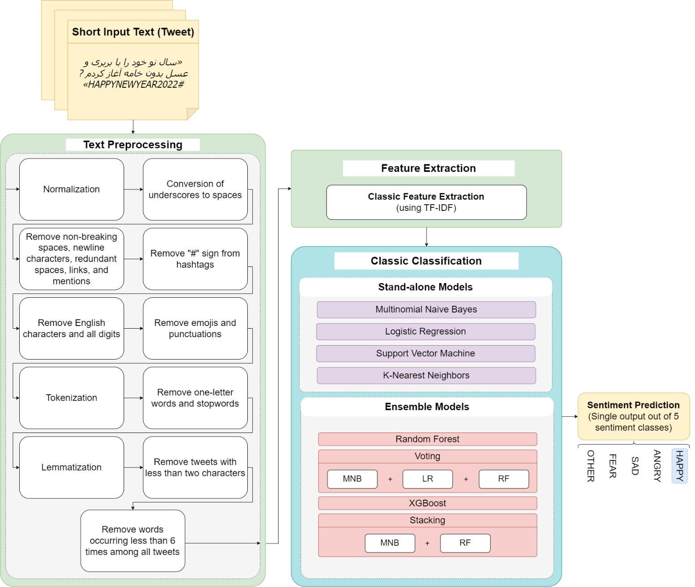

- Overview of deep approaches (stand-alone + ensembles):
  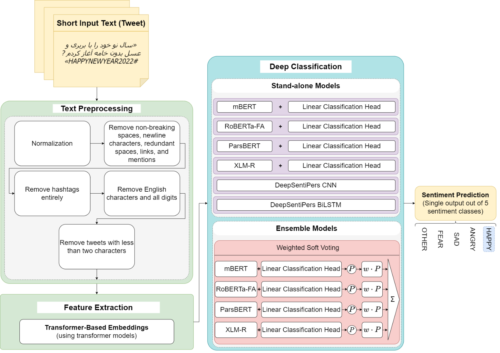

- Class distribution — ShortPersianEmo (5,472 tweets, 5 classes):
  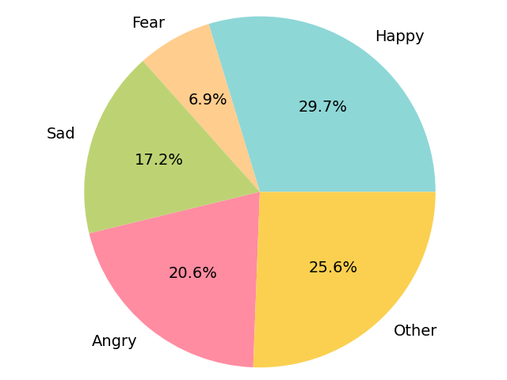

- Word clouds per class after preprocessing:
  - ANGRY: 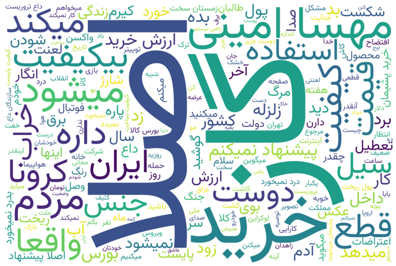
  - FEAR: 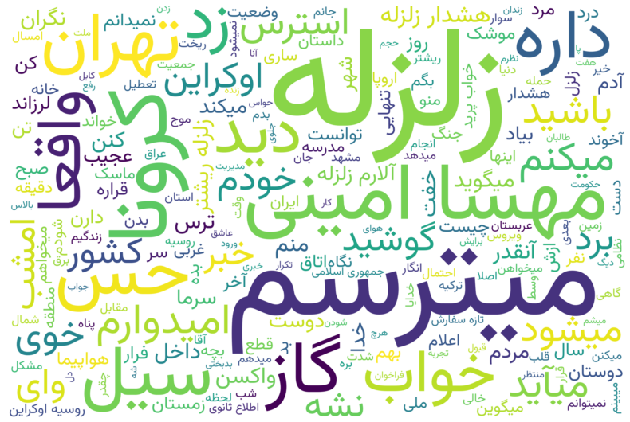
  - HAPPY: 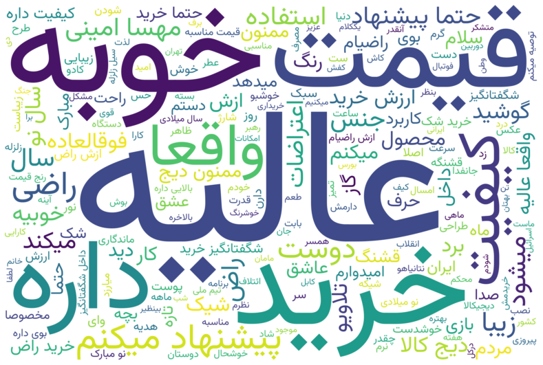
  - OTHER: 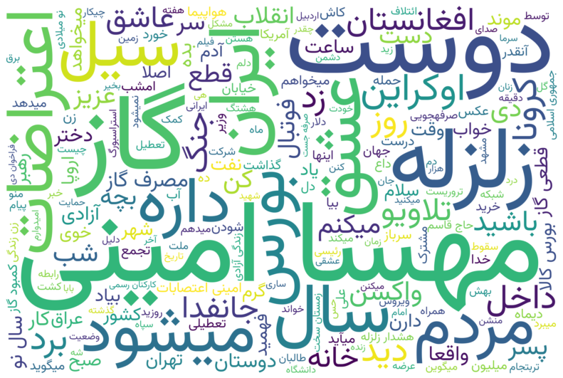
  - SAD: 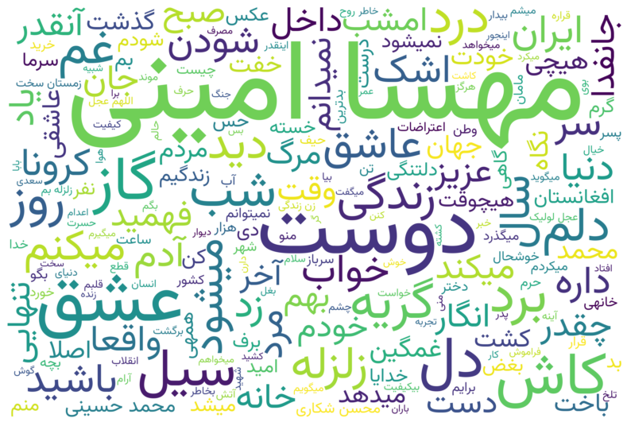

- Weighted F1 (classical vs classical ensembles, tuned):
  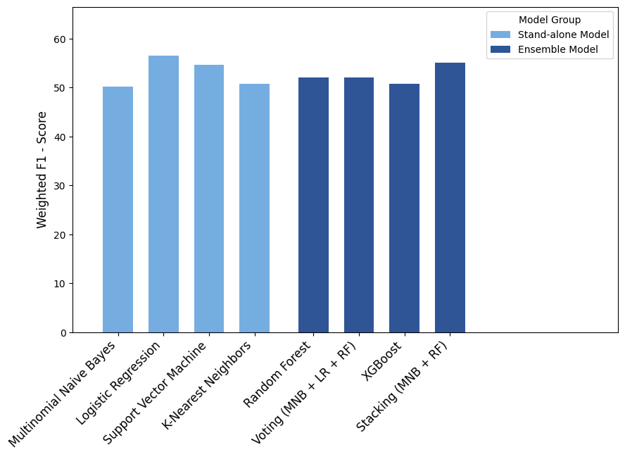

- Weighted F1 (transformer baselines vs transformer ensemble):
  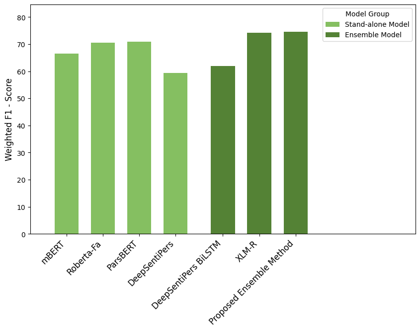

- Weighted F1 overview (four main approaches):
  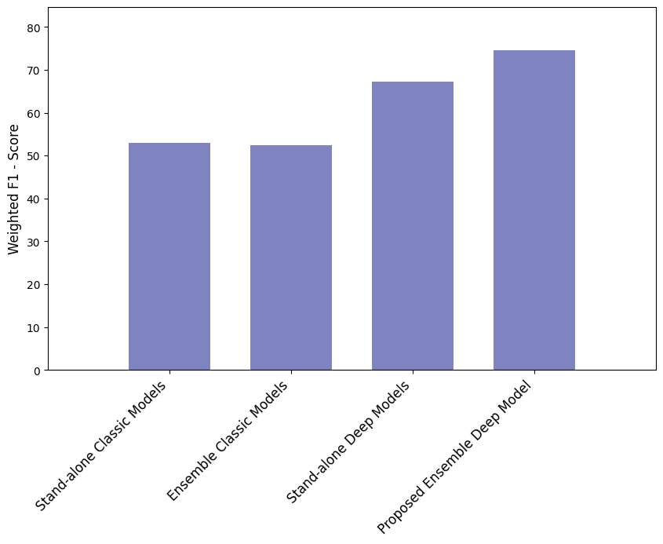

## Data

- **DeepSentiPers** (Kaggle) — `original.csv`, `balanced.csv`, `translation.csv`, `test.csv` referenced in the notebook.
- **Short Persian Emotion Tweets** — `train_fa.csv`, `test_fa.csv` from the [ShortPersianEmo repository](https://github.com/vkiani/ShortPersianEmo).
- Update the dataset paths at the top of each notebook if you run locally instead of Kaggle.

## Environment

Core dependencies used across notebooks:

```
python>=3.10
scipy==1.11.4
contractions
hazm
scikit-learn
xgboost
transformers
torch
matplotlib
```

If running on Kaggle, the first cell writes `requirements.txt` and installs what is needed. For local execution:

```
python3 -m venv .venv
source .venv/bin/activate
pip install -r requirements.txt
```

Hugging Face models (ParsBERT, XLM-R, mBERT, RoBERTa-fa) will download automatically on first use; ensure you have internet and enough GPU memory.

## How to reproduce

1. Open the notebook of interest (Kaggle or Jupyter) and update dataset paths if needed.
2. Run preprocessing cells (UTF-8 checks, normalization, tokenization, TF-IDF where applicable).
3. Execute model sections; grid-search blocks are already configured with reasonable search spaces.
4. Review the generated metrics, confusion matrices, and execution-time logs printed in the final cells.

## Notes

- The notebooks include hooks for ensembling (voting/stacking for classic models and room to extend deep-model ensembling).
- Paper preview available on request; feel free to reach out for a copy or additional experimental details.
